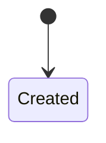

### 📥 Accepted commands

```dataview
table description, preconditions
from "glossary/command"
where target_aggregate = this.file.link
```

### 📤 Emitted events

```dataview
table description, invariant_guaranteed
from "glossary/event"
where emitted_by = this.file.link
```

### 🔐 Invariants

- Each `Collection` must have a globally unique `Collection Id`.
- A `Collection` cannot contain duplicate `Component Ids`.
- A `Collection` cannot be deleted or modified once created (immutable aggregate).
- A `Collection` cannot include deprecated components.

### 🔁 State transitions



_Note: `Collection` is immutable. No further transitions._
