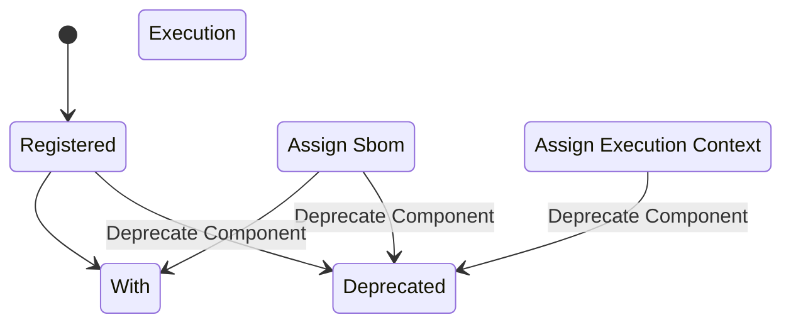

### 📤 Emitted events

```dataview
table description, invariant_guaranteed
from "glossary/event"
where emitted_by = this.file.link
```

### 🔐 Invariants

- Each `Component` must have a unique `Component Id` (registry + namespace + name + tag + digest).
- A `Component` must not receive more than one SBOM.
- SBOMs are immutable once assigned.
- A `Component` must not receive an execution context more than once, unless explicitly replaced.
- A `Component` cannot be re-registered.
- A `Component` marked as deprecated must not accept new SBOMs or context updates.

### 🔁 State transitions


