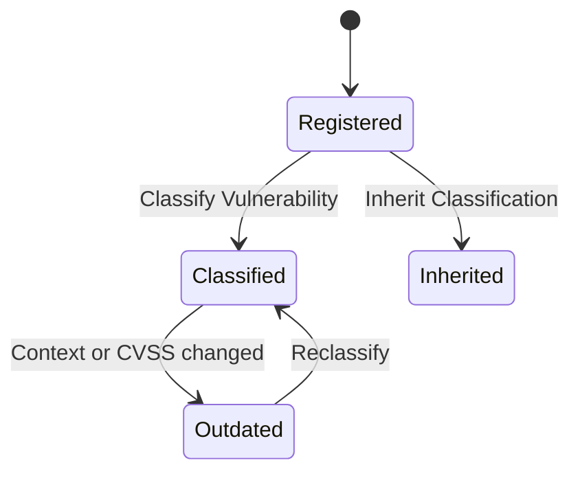

### 📤 Emitted events

```dataview
table description, invariant_guaranteed
from "glossary/event"
where emitted_by = this.file.link
```

### 🔐 Invariants

- Each `Managed Vulnerability` must be uniquely identified by a `Vulnerability Id` + `Component Id`.
- A `Managed Vulnerability` must always have one and only one classification: `Classified`, `Inherited` or `Outdated`.
- A vulnerability classified as `Inherited` must reference a valid classification source.
- A vulnerability cannot be re-registered.
- Classification requires that the component has an assigned execution context.

### 🔁 State transitions


